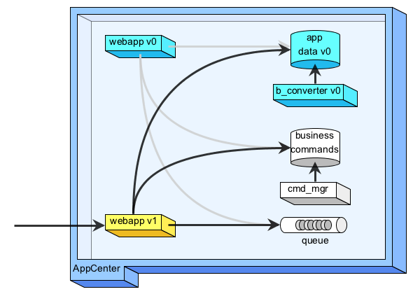
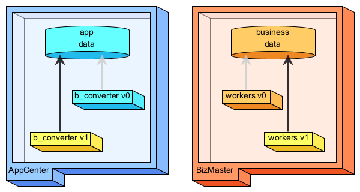

# avc-diagrammer

Ad hoc tools in Java that generate SVG diagrams.

## Hello World!

The following program
(Java code: [MyFirstDiagram.java](src/test/java/net/avcompris/tools/diagrammer/sample/MyFirstDiagram.java)):

    public class MyFirstDiagram extends AvcDiagrammer {

        public static void main(final String... args) {
        
            new MyFirstDiagram().run(160, 80);
        }
        
        @Override
        protected void body() {
        
            box(10, 10, 100, "#69f", "Hello", "*World!*");
        }
    }
    
will output to stdout the following image (in SVG): [MyFirstDiagram.svg](src/site/resources/images/MyFirstDiagram.svg)

## Samples

  * Java code: [AppCenters.java](src/test/java/net/avcompris/tools/diagrammer/sample/AppCenters.java)
  
    SVG file: [AppCenters.svg](src/site/resources/images/AppCenters.svg)
  
    <!--  -->

    

  * Java code: [DefaultArchitecture.java](src/test/java/net/avcompris/tools/diagrammer/sample/DefaultArchitecture.java)
  
    SVG file: [DefaultArchitecture.svg](src/site/resources/images/DefaultArchitecture.svg)
    
    <!--  -->

    

  * Java code: [MigrationScenario1_1.java](src/test/java/net/avcompris/tools/diagrammer/sample/MigrationScenario1_1.java)
    [1_2.java](src/test/java/net/avcompris/tools/diagrammer/sample/MigrationScenario1_2.java)
    [1_3.java](src/test/java/net/avcompris/tools/diagrammer/sample/MigrationScenario1_3.java)
    [1_4.java](src/test/java/net/avcompris/tools/diagrammer/sample/MigrationScenario1_4.java)
    
    SVG files: [MigrationScenario1_1.svg](src/site/resources/images/MigrationScenario1_1.svg)
    [1_2.svg](src/site/resources/images/MigrationScenario1_2.svg)
    [1_3.svg](src/site/resources/images/MigrationScenario1_3.svg)
    [1_4.svg](src/site/resources/images/MigrationScenario1_4.svg)

     &nbsp;&nbsp;&nbsp;&nbsp;
     &nbsp;&nbsp;&nbsp;&nbsp;
     &nbsp;&nbsp;&nbsp;&nbsp;
    
        
  * Java code: [MigrationScenario2_1.java](src/test/java/net/avcompris/tools/diagrammer/sample/MigrationScenario2_1.java)
    [2_2.java](src/test/java/net/avcompris/tools/diagrammer/sample/MigrationScenario2_2.java)
    [2_3.java](src/test/java/net/avcompris/tools/diagrammer/sample/MigrationScenario2_3.java)
    [2_4.java](src/test/java/net/avcompris/tools/diagrammer/sample/MigrationScenario2_4.java)
   
    SVG files: [MigrationScenario2_1.svg](src/site/resources/images/MigrationScenario2_1.svg)
    [2_2.svg](src/site/resources/images/MigrationScenario2_2.svg)
    [2_3.svg](src/site/resources/images/MigrationScenario2_3.svg)
    [2_4.svg](src/site/resources/images/MigrationScenario2_4.svg)

     &nbsp;&nbsp;&nbsp;&nbsp;
     &nbsp;&nbsp;&nbsp;&nbsp;
     &nbsp;&nbsp;&nbsp;&nbsp;
    
                                                                                                
  * Java code: [MigrationScenario3_1.java](src/test/java/net/avcompris/tools/diagrammer/sample/MigrationScenario3_1.java)
    [3_2.java](src/test/java/net/avcompris/tools/diagrammer/sample/MigrationScenario3_2.java)
    [3_3.java](src/test/java/net/avcompris/tools/diagrammer/sample/MigrationScenario3_3.java)
    [3_4.java](src/test/java/net/avcompris/tools/diagrammer/sample/MigrationScenario3_4.java)
    [3_5.java](src/test/java/net/avcompris/tools/diagrammer/sample/MigrationScenario3_5.java)
  
    SVG files: [MigrationScenario3_1.svg](src/site/resources/images/MigrationScenario3_1.svg)
    [3_2.svg](src/site/resources/images/MigrationScenario3_2.svg)
    [3_3.svg](src/site/resources/images/MigrationScenario3_3.svg)
    [3_4.svg](src/site/resources/images/MigrationScenario3_4.svg)
    [3_5.svg](src/site/resources/images/MigrationScenario3_5.svg)

     &nbsp;&nbsp;&nbsp;&nbsp;
     &nbsp;&nbsp;&nbsp;&nbsp;
     &nbsp;&nbsp;&nbsp;&nbsp;
     &nbsp;&nbsp;&nbsp;&nbsp;
    
                                                                                                                                                                                                                                                                                               
  * Java code: [MigrationScenario4_1.java](src/test/java/net/avcompris/tools/diagrammer/sample/MigrationScenario4_1.java)
    [4_2.java](src/test/java/net/avcompris/tools/diagrammer/sample/MigrationScenario4_2.java)
    [4_3.java](src/test/java/net/avcompris/tools/diagrammer/sample/MigrationScenario4_3.java)
    [4_4.java](src/test/java/net/avcompris/tools/diagrammer/sample/MigrationScenario4_4.java)
    
    SVG files: [MigrationScenario4_1.svg](src/site/resources/images/MigrationScenario4_1.svg)
    [4_2.svg](src/site/resources/images/MigrationScenario4_2.svg)
    [4_3.svg](src/site/resources/images/MigrationScenario4_3.svg)
    [4_4.svg](src/site/resources/images/MigrationScenario4_4.svg)

     &nbsp;&nbsp;&nbsp;&nbsp;
     &nbsp;&nbsp;&nbsp;&nbsp;
     &nbsp;&nbsp;&nbsp;&nbsp;
    
                                                                                                                                                                                                                                                                                               
  * Java code: [MigrationScenario5_1.java](src/test/java/net/avcompris/tools/diagrammer/sample/MigrationScenario5_1.java)
    [5_2.java](src/test/java/net/avcompris/tools/diagrammer/sample/MigrationScenario5_2.java)
    [5_3.java](src/test/java/net/avcompris/tools/diagrammer/sample/MigrationScenario5_3.java)
    [5_4.java](src/test/java/net/avcompris/tools/diagrammer/sample/MigrationScenario5_4.java)
    
    SVG files: [MigrationScenario5_1.svg](src/site/resources/images/MigrationScenario5_1.svg)
    [5_2.svg](src/site/resources/images/MigrationScenario5_2.svg)
    [5_3.svg](src/site/resources/images/MigrationScenario5_3.svg)
    [5_4.svg](src/site/resources/images/MigrationScenario5_4.svg)

     &nbsp;&nbsp;&nbsp;&nbsp;
     &nbsp;&nbsp;&nbsp;&nbsp;
     &nbsp;&nbsp;&nbsp;&nbsp;
    

                                                                                                
  * Java code: [MigrationScenario6_1.java](src/test/java/net/avcompris/tools/diagrammer/sample/MigrationScenario6_1.java)
    [6_2.java](src/test/java/net/avcompris/tools/diagrammer/sample/MigrationScenario6_2.java)
    [6_3.java](src/test/java/net/avcompris/tools/diagrammer/sample/MigrationScenario6_3.java)
    [6_4.java](src/test/java/net/avcompris/tools/diagrammer/sample/MigrationScenario6_4.java)
    [6_5.java](src/test/java/net/avcompris/tools/diagrammer/sample/MigrationScenario6_5.java)
  
    SVG files: [MigrationScenario6_1.svg](src/site/resources/images/MigrationScenario6_1.svg)
    [6_2.svg](src/site/resources/images/MigrationScenario6_2.svg)
    [6_3.svg](src/site/resources/images/MigrationScenario6_3.svg)
    [6_4.svg](src/site/resources/images/MigrationScenario6_4.svg)
    [6_5.svg](src/site/resources/images/MigrationScenario6_5.svg)

     &nbsp;&nbsp;&nbsp;&nbsp;
     &nbsp;&nbsp;&nbsp;&nbsp;
     &nbsp;&nbsp;&nbsp;&nbsp;
     &nbsp;&nbsp;&nbsp;&nbsp;
    
